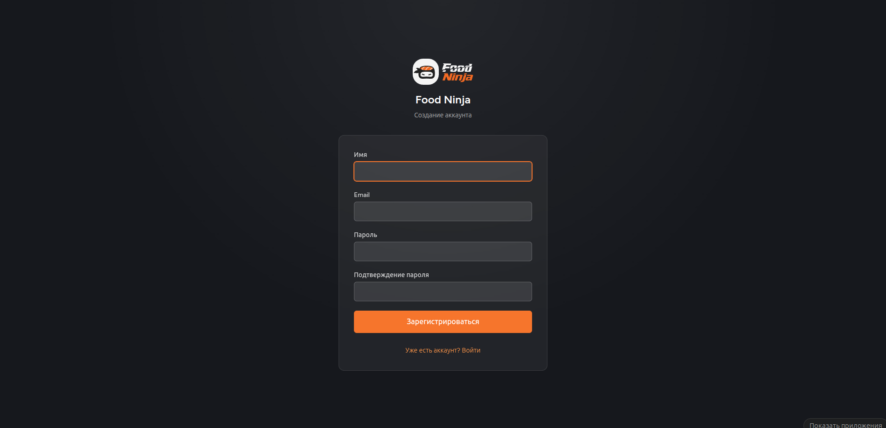
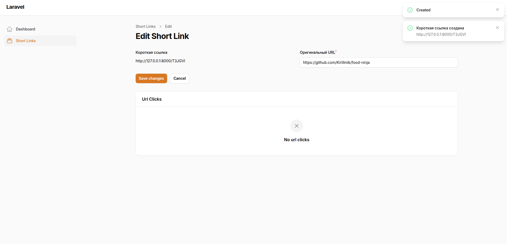

# Food Ninja (Laravel + Vue)

Сервис сокращения ссылок с личным кабинетом и учётом переходов.

## Стек

- Backend: `Laravel 13`, `PHP 8.3`, `Filament 3`
- Frontend: `Vue 3`, `Inertia.js`, `Vite`, `Tailwind CSS`
- Auth: `Laravel Breeze`
- База данных: `SQLite` (по умолчанию) или `MySQL`
- Dev-tools: `PHPStan` (level 7), `Rector` + `rector-laravel`

## Что реализовано

- Главная страница (`/`) приветствие, кнопки входа и регистрации.
- Регистрация и вход (`/register`, `/login`) оформлены в стиле главной страницы.
- Личный кабинет (`/admin`) панель Filament для управления ссылками.
- Создание коротких ссылок:
  - пользователь указывает оригинальный URL
  - код из 6 символов генерируется в `ShortLinkService`
  - короткая ссылка отображается как `/{code}`
- Редирект по короткой ссылке: `GET /{code}`.
- Учёт кликов: IP-адрес и время перехода сохраняются в `url_clicks`.
- Список ссылок пользователя только свои записи (`getEloquentQuery()`).
- Удаление ссылок из кабинета.
- Счётчик кликов в таблице ссылок.
- Детализация кликов по каждой ссылке (вкладка в редактировании).


## Запуск проекта

```bash
composer install
npm install
```

Настроить окружение и базу:

```bash
cp .env.example .env
php artisan key:generate
php artisan migrate
```

Запуск:

```bash
php artisan serve
```

В отдельном терминале:

```bash
npm run dev
```

Открыть: `http://127.0.0.1:8000`

Кабинет: `http://127.0.0.1:8000/admin`

### Быстрый запуск (всё сразу)

```bash
composer dev
```

Поднимает сервер, очередь, логи и Vite одной командой.

## Проверка сценария

1. Зарегистрироваться на `/register`.
2. Перейти в `/admin` и создать ссылку с оригинальным URL.
3. Открыть короткую ссылку вида `http://127.0.0.1:8000/{code}` произойдёт редирект.
4. В кабинете открыть ссылку на редактирование на вкладке кликов появится запись с IP и временем.

## Статический анализ и рефакторинг

В проекте используются **PHPStan** и **Rector** для проверки и улучшения PHP-кода.

```bash
composer phpstan
```

Статический анализ (level 7, конфиг: `phpstan.neon`).

```bash
composer rector:dry
```

Просмотр предлагаемых изменений Rector без применения.

```bash
composer rector
```

Применение автоматических правок Rector (конфиг: `rector.php`).

## Скриншоты




